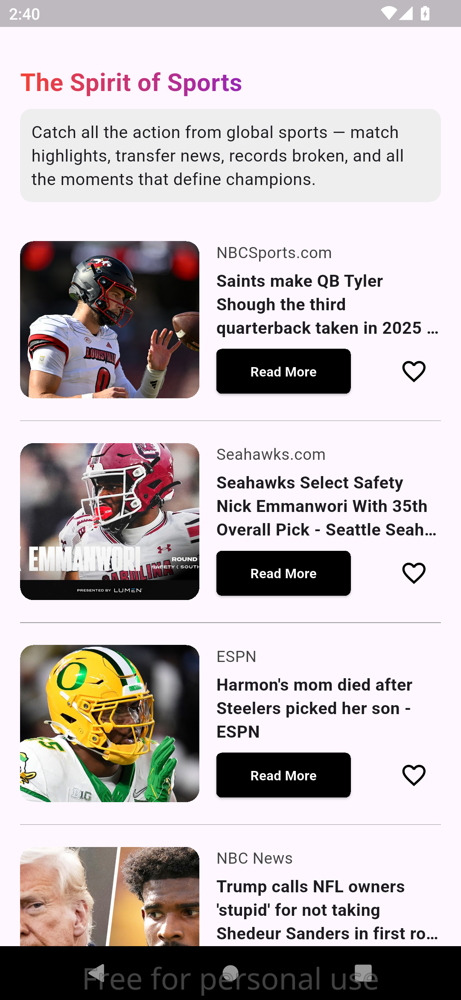

# flutter_news

A new Flutter project.

## Getting Started

This project is a starting point for a Flutter application.

A few resources to get you started if this is your first Flutter project:

- [Lab: Write your first Flutter app](https://docs.flutter.dev/get-started/codelab)
- [Cookbook: Useful Flutter samples](https://docs.flutter.dev/cookbook)

For help getting started with Flutter development, view the
[online documentation](https://docs.flutter.dev/), which offers tutorials,
samples, guidance on mobile development, and a full API reference.

Flutter News App
📰 Key Features:
- Live News: The app allows you to follow the latest news from trusted sources in various fields such as politics, sports, entertainment, technology, and more.

- Clean and User-Friendly Interface: The user interface is designed to be simple and clear with attractive colors, creating an enjoyable experience.

- Dynamic Animation: A distinctive animation for circles on the splash screen adds a lively visual touch during data loading.

- Real-Time News Updates: The app lets you browse news directly with live updates using an API.

Category Support: You can navigate through news by categories such as:

- Top Headlines

- Politics

- Technology

- Sports

- Entertainment

- Health

- And more.

🚀 Technologies Used:
- Flutter: The main framework for building the app.

- Dio: For making HTTP requests to the API and fetching news.

- NewsAPI: The news provider used to pull real-time news.

- Animated Containers: For dynamically animating UI elements to catch the user's attention.

🔧 App Steps:
- Splash Screen: Displays news animation during app loading, then transitions to the main screen.

- Main Screen: Displays news based on selected categories. Users can switch between categories smoothly.

- API Fetching: The app fetches news from NewsAPI and displays it according to the category chosen by the user.

- Automatic Data Loading: After 3 seconds on the splash screen, news is loaded automatically as the user transitions to the main screen.

🧑‍💻 How to Use:
1- Download the project to your machine.

2- Install the dependencies using: flutter pub get

3- Run the app on the emulator or a device: flutter run

💡 Project Goals:
- Learn how to use Flutter practically.

- Improve my skills in working with APIs and handling live data.

- Build an app with an attractive and user-friendly interface.

- Showcase this project in my personal portfolio to highlight my app development skills.

---

## 📸 Screenshots from the App:

  
  
  
  
  

🚀 Notes:
- This project is my first step into learning and developing apps with Flutter.

